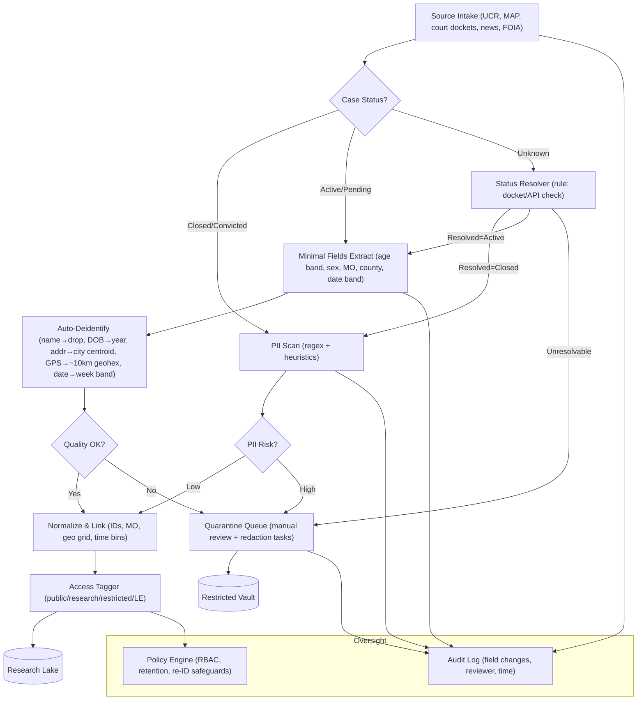

# Murder Accountability Project Fork

This space is meant to serve as an initial open-source space for a collection of scripts and tools for open-source use.

The aim is to aid in the analysis of the murder accountability project's datasets. This space is evolving fast, a few upgrades are in the works:

- Agent integration for in-depth feature engineering and ML layer integrations.
- Three.js globe visualization with multi-layer data graphic filters.
- Law enforcement cooperation through live agent development and monitoring (following BOLA wrap model, currently not available to the public)

Project Map

Protecting PII (Personally Identifiable Information) is done by implementing strict and rigosour filters that are run throughout different stages.

